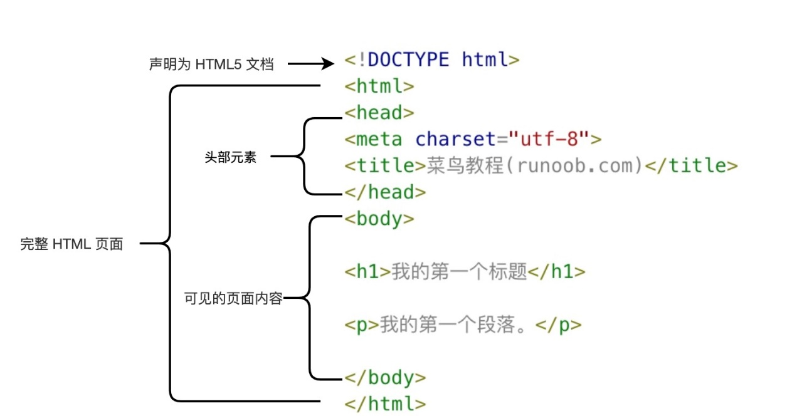
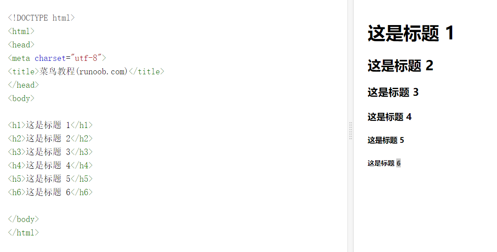

# 基础知识

HTML的英文为HyperText Makeup
Language，在前端中用于表示网页的组成结构。我们通过在HTML中使用CSS来展示不同的风格，通过JavaScript来实现与用户的交互。

1.  组成

一个完整的HTML页面应该包含以下几个部分。

文件声明：

\<!DOCTYPE html\>:声明为HTML5文档

头部元素：

\<html\>:作为html页面的根元素

\<head\>:包含了文档的元数据，这部分内容在页面上并非直接可见，主要是为了定义页面展示上的属性

\<title\>:描述文档的标题

可见内容：

\<body\>:包含可见的页面内容

\<h1\>:定义一级标题

\<p\>:定义一个段落

在这之中，使用\<\>括起来的我们称之为标签，标签应该是成对出现的，如有\<a\>作为开头必有\</a\>作为结尾。称\<a\>为开始标签，\</a\>为结束标签。

我们将\<a\>与\</a\>以及之间的内容在一起称为元素。在html中存在一种空元素，以\<br\>开头，但是无结尾的标签。

2)元素

标题：HTML中有六个等级的标题，如\<h1\>、\<h2\>……直到\<h6\>

段落：HTML中段落以\<p\>标签进行表示

链接：以标签\<a\>进行表示

图像：以标签\进行表示

HTML中对大小写不敏感，\<P\>与\<p\>是一样的。在万维网联盟中推荐使用小写，而未来的XHTML版本则强制使用小写。
